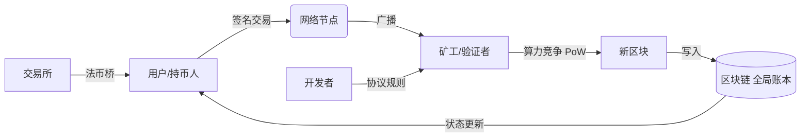
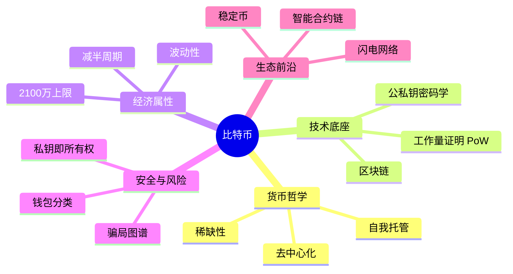
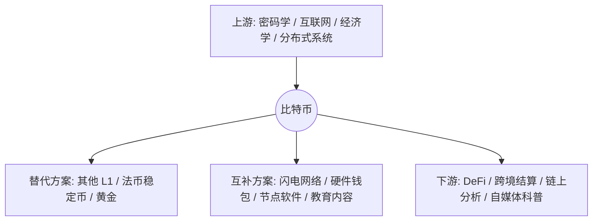

# 比特币 · AI 时代学习地图（Bitcoin Learning Map）

> 本文件是「宝盒比特币」内容矩阵的**心智模型中枢**。
> 假设 AI 已接管绝大多数具体操作（安装、命令、语法、API、菜单、步骤），
> 因此本文**不教你怎么用比特币**，而是帮你建立关于它的
> **Mental Model（心智模型）**、**World Model（世界模型）**与 **Decision Model（决策模型）**。
> 长期维护，可随认知升级持续修订。

---

## 0. 一句话定位

> 比特币是一套**不依赖任何中心机构、靠密码学与全球共识来共同维护「谁拥有什么」的稀缺电子现金系统**。

AI 负责"怎么转、怎么签、怎么验证"的全部操作；你只需要理解"它是什么、为何存在、何时该想到它、它在体系中的位置"。

---

# 1. 本质（Essence）

**它究竟是什么？**
比特币是一个**去中心化的、公开的、由代码规则而非公司管理的价值记账网络**。它同时是三件事：一种货币（记账单位）、一个结算网络（转账系统）、一份全球共享且不可篡改的账本（区块链）。

**为什么它存在？**
为了解决一个古老难题——**在没有可信中间人的情况下，如何防止同一笔钱被花两次（双花）**。传统方案靠银行/支付公司做担保；比特币用"公开账本 + 密码学签名 + 算力竞争"替代了"信任某个机构"。

**它解决什么根本问题？**
- 去信任化：不需要彼此认识、也不需要共同的银行，就能转账。
- 抗审查与抗没收：没有"总部"可施压关停。
- 固定稀缺：发行量由代码写死，不受任何一方的印钞权影响。

**没有它时，人们通常怎么办？**
- 用银行/第三方支付（牺牲隐私、可被冻结、跨境慢且贵）。
- 用黄金/实物（难分割、难转移、需托管）。
- 用外汇或稳定资产避险（仍受国家货币政策摆布）。

**它带来了哪些新的可能？**
- 任何人、 anywhere、无需许可即可接入的全球结算层。
- 可编程的稀缺性（2100 万上限 + 约 4 年减半）。
- 一种"自我托管"的资产范式：私钥即所有权，催生自保管钱包、去中心化金融（DeFi）等上层世界。

> 重点在 **Why**：比特币不是"更快的支付"，而是"把'信任'从机构手里挪到了数学与网络里"。

---

# 2. 世界模型（World Model）

> 它在整个生态系统中的位置是什么？

- **处理的对象（Objects）**：交易（transaction）、未花费输出（UTXO）、区块、私钥/公钥、哈希、 Merkle 树。
- **涉及的角色（Actors）**：用户（持币人）、矿工/验证者（维护账本）、节点（全节点/轻节点）、开发者（协议贡献）、交易所（法币↔比特币的桥梁，注意：交易所≠比特币本身）。
- **管理的状态变化（State）**：每个区块确认后，全局"余额状态"向前推进；双花被共识拒绝。
- **改变的工作流（Workflow）**：跨境汇款、资产自保管、抗通胀储蓄、链上审计——这些原本依赖银行的流程，被"签名 + 广播 + 共识确认"替代。
- **交互的系统（Systems）**：互联网（传播）、密码学原语（ECDSA/SHA-256）、经济激励（区块奖励+手续费）、电与硬件（算力）。
- **创造的价值（Value）**：可验证的稀缺、无许可的全球可达性、抗审查的结算确定性。



---

# 3. 概念地图（Concept Map）

按 2～3 层组织。重点看**关系**，而非孤立定义。



| 概念 | 名词（Entity） | 动词（Action） | 目的（Purpose） | 关系（Relationship） |
|---|---|---|---|---|
| 区块链 | 公开账本 | 记录/链接 | 让所有人看到同一份真相 | 是比特币的"数据库" |
| 工作量证明 | 算力竞赛 | 竞争记账权 | 让作恶成本高于诚实 | 保护区块链不被篡改 |
| 私钥/公钥 | 密钥对 | 签名/验证 | 证明"是你授权了这笔钱" | 私钥→所有权，公钥→地址 |
| UTXO | 未花费输出 | 被消耗/生成 | 表达"余额"的最小单位 | 交易由 UTXO 组合而成 |
| 减半 | 发行事件 | 降低新增速度 | 制造可预测的稀缺 | 驱动稀缺叙事 |
| 闪电网络 | 二层通道 | 链下微支付 | 解决主链慢/贵 | 是比特币的扩展层 |
| 钱包 | 密钥管理器 | 保管/签名 | 让你安全使用比特币 | 不存币，只存钥匙 |

---

# 4. 决策地图（Decision Map）

> 什么情况下，专业人士会自然想到它？

**场景 A：跨境/无银行账户的价值转移**
```
Situation：要给海外合作方付一笔款，银行贵、慢、还要问东问西
↓ Decision：用比特币网络直接点对点转账
↓ Reason：无许可、7×24、不可被单方面冻结
↓ Expected Outcome：几分钟到几十分钟到账，费用与金额弱相关（但需自管私钥）
```

**场景 B：对抗本币大幅贬值（储蓄层面）**
```
Situation：所在国通胀高企，法币购买力持续缩水
↓ Decision：将部分储蓄表达为比特币（自我托管）
↓ Reason：2100 万上限使其具备"硬上限"属性
↓ Expected Outcome：获得一种全球通用的稀缺标的，但需承受剧烈波动
```

**场景 C：评估"区块链项目"真伪**
```
Situation：有人推介某个"币"，宣称能暴富
↓ Decision：先问"它是否去中心化？是否有真实稀缺？是否自我托管？"
↓ Reason：多数骗局只借比特币名头，无对应技术/治理
↓ Expected Outcome：快速识别"空气币 / 资金盘"
```

> 注意：以上描述的是"想到它"的情境框架，**不构成任何操作建议**。

---

# 5. 搜索空间扩展（Search Space Expansion）

初学者通常只问"怎么买、会不会涨"。专家关心的是下面的"你不知道自己不知道"：

- **初学者常忽略的问题**
  - 私钥丢了为什么真的找不回？（自托管的双刃剑）
  - "转账费"是谁收的？为什么有时很贵？
  - 交易所里的"余额"和链上的"余额"是一回事吗？

- **专家真正关心的问题**
  - 算力集中化（矿池）是否会威胁去中心化？
  - 协议升级（如 Taproot）如何在不分叉的前提下演进？
  - 减半后手续费能否支撑安全预算？

- **下一步值得探索的问题**
  - 闪电网络如何做到"链下即时、链上最终结算"？
  - 门限签名 / 多签如何提升机构级安全？
  - 监管（如各国对"虚拟货币"定性）如何影响可达性？

- **决定这个领域上限的问题**
  - 当 2140 年区块奖励归零，网络安全由谁买单？
  - 量子计算会不会破解椭圆曲线签名？
  - 比特币最终是"数字黄金"（储值）还是"全球结算层"（支付）？

---

# 6. 生态系统（Ecosystem）



- **上游（Upstream）**：现代密码学（哈希、非对称加密）、P2P 网络、货币经济学、博弈论。
- **下游（Downstream）**：去中心化金融、跨境汇款、链上取证、监管与合规科技。
- **替代方案（Alternatives）**：其他公链（以太坊等）、中心化稳定币、实物黄金、法币体系。
- **互补方案（Complements）**：闪电网络（扩展）、硬件冷钱包（安全）、全节点（验证）、科普与教育内容（ adoption）。

---

# 7. 可迁移原则（Transferable Principles）

- **第一性原理**：信任可以来自数学与激励，而非机构。
- **可迁移方法论**：用"公开账本 + 经济惩罚"替代"中心化担保"，可迁移到投票、供应链、身份等多个领域。
- **当前实现细节**（易变）：具体手续费水平、某矿池占比、某国监管口径——会随时间与地点变化。
- **长期稳定的知识**：稀缺由代码保证、私钥即所有权、双花由共识阻止——这些长期不变。
- **容易变化的知识**：价格、热度、具体项目成败、短期政策——不要把它们当"本质"。

---

# 8. 最小心智模型（Minimum Mental Model）

若只记 15 个概念，按重要性排序：

1. **去中心化** —— 没有总部，靠网络共同维护。
2. **区块链** —— 人人可查、不可篡改的公开账本。
3. **稀缺性（2100 万）** —— 代码写死的硬上限。
4. **私钥 = 所有权** —— 谁握钥匙，谁拥有币；丢了找不回。
5. **公钥/地址** —— 用来收款，可公开。
6. **数字签名** —— 证明"是你授权了这笔钱"。
7. **工作量证明 PoW** —— 用算力竞争换记账权，作恶不划算。
8. **减半** —— 约每 4 年新增速度减半，制造可预测稀缺。
9. **双花** —— 比特币从设计上杜绝的核心问题。
10. **节点** —— 保存并验证账本的电脑，网络去中心化的根基。
11. **矿工** —— 竞争记账、获得奖励的参与者。
12. **UTXO** —— "余额"其实是未花费输出的组合。
13. **钱包** —— 管钥匙的工具，不"存"币。
14. **闪电网络** —— 二层方案，解决主链慢与贵。
15. **波动性** —— 价格剧烈波动是客观事实，非"稳赚"。

> 记住这 15 个，你已胜过 90% 只听过"比特币能暴富"的人。

---

# 9. 常见误区（Common Misconceptions）

| 误区 | 为什么会产生 | 更准确的心智模型 |
|---|---|---|
| "比特币是骗局" | 被大量空气币/资金盘借名抹黑 | 比特币是去中心化协议本身；骗局是借它名头的项目 |
| "比特币能稳赚" | 牛市叙事+幸存者偏差 | 它波动剧烈，本质是实验性稀缺资产 |
| "我在交易所买的币就在链上" | 把平台余额等同于所有权 | 交易所是托管；真正所有权=你自己握私钥 |
| "丢币能找回" | 习惯了银行客服 | 链上无客服，私钥丢失=永久丧失 |
| "比特币只为暗网/绕监管" | 早期偏见新闻 | 它是中立技术，用途取决于使用者 |
| "区块链=比特币" | 概念混淆 | 区块链是技术，比特币是跑在其上的第一个应用 |

---

# 10. 总结（Summary）

> 我真正获得的不是 **"一个能一夜翻倍的投资标的"**，
> 而是 **"一种关于'信任、稀缺与所有权'的全新心智模型，以及看懂整个加密世界的坐标系"**。

---

*本文件由「宝盒比特币」维护，作为公众号连载与网站学习地图的母本。任何发布内容须走 `docs/CONTENT-GUIDE.md` 九项自查。*
